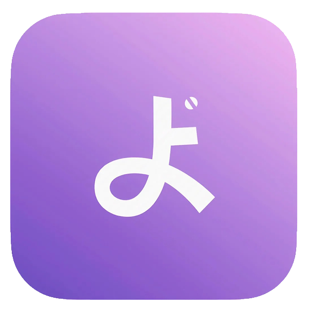
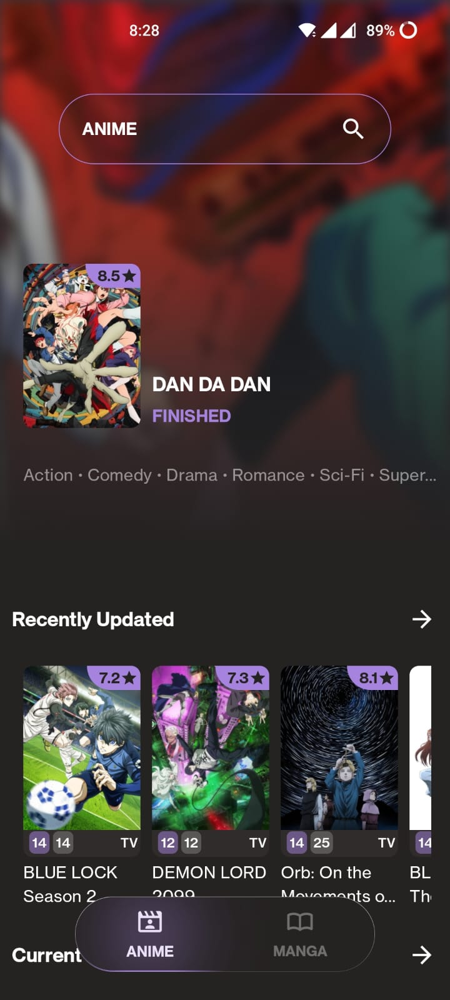
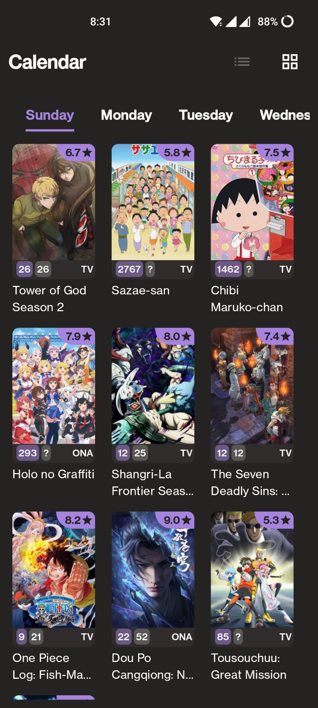
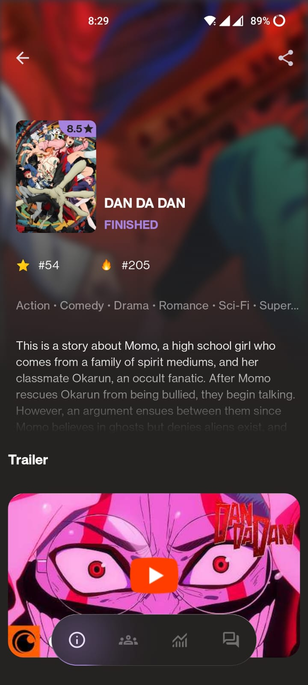
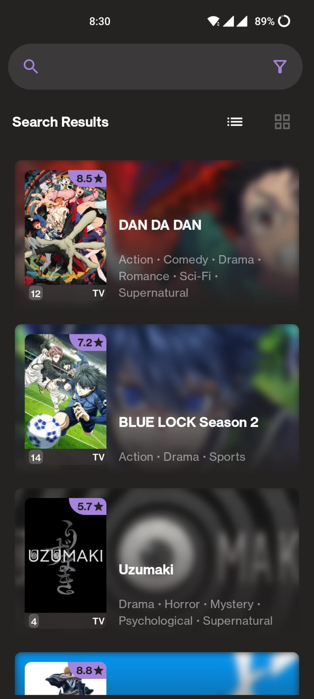
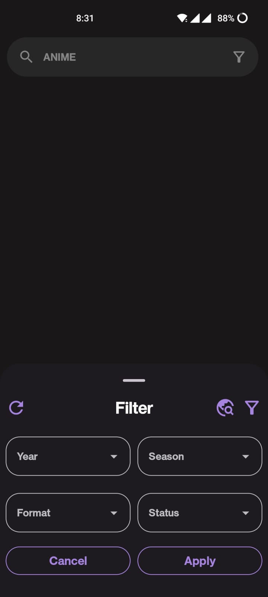
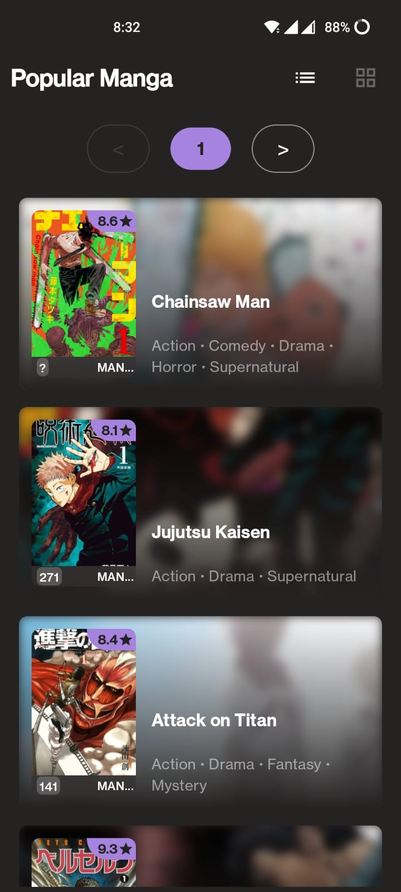

<h1 align="center">Otaku</h1>

Otaku is a modern Android application tailored for anime and manga enthusiasts to effortlessly discover, share, and experience their favorite titles. 
Built using the latest MVVM architecture principles and a multimodular approach, Otaku leverages <a href="https://anilist.co/">AniList</a> to deliver a seamless and feature-rich browsing experience. Please note that Otaku is an unofficial AniList client.

 

## Screenshots

 &nbsp;  &nbsp; 

 &nbsp;  &nbsp; 

 

## 🚀 Tech Stack and Libraries  

Otaku is built using the latest technologies and modern Android development practices:  

### **🛠️ Tech Stack**  
- **Programming Language:** Kotlin  
- **Architecture Pattern:** MVVM (Model-View-ViewModel)  
- **Multimodular Approach:** Organized codebase for scalability and maintainability  
- **UI Framework:** Jetpack Compose  
- **Dependency Injection:** Hilt  
- **GraphQL Client:** Apollo GraphQL  

### **📚 Open-Source Libraries**  
- **UI Components:**  
  - **Material3** - Modern Material Design components  
  - **Coil-Compose** - Image loading and caching  
  - **Rich Editor Compose** - Text editor with rich formatting options  
  - **Haze** - Blur and shadow effects for UI  

- **Networking and API Integration:**  
  - **Apollo GraphQL** - Querying AniList GraphQL APIs  

- **State Management and Navigation:**  
  - **Jetpack Navigation Compose** - Managing navigation within the app  
  - **Lifecycle Components** - Handling lifecycle-aware components  

- **Testing Frameworks:**  
  - **JUnit** - Unit testing  
  - **Mockk** - Mocking dependencies in tests  
  - **Espresso** - UI testing framework  

- **Other Tools:**  
  - **Timber** - Logging utility  
  - **Spotless** - Code formatting and linting   
  - **Android YouTube Player** - Video playback for trailers
 
 

## Shoutouts

Some apps that I referred to while developing:
- [Dantotsu](https://github.com/rebelonion/Dantotsu)
- [AniHyou](https://github.com/axiel7/AniHyou-android)
- [AL-chan](https://github.com/zend10/AL-chan)
