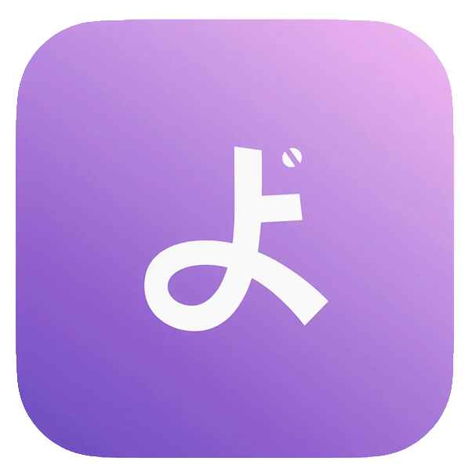
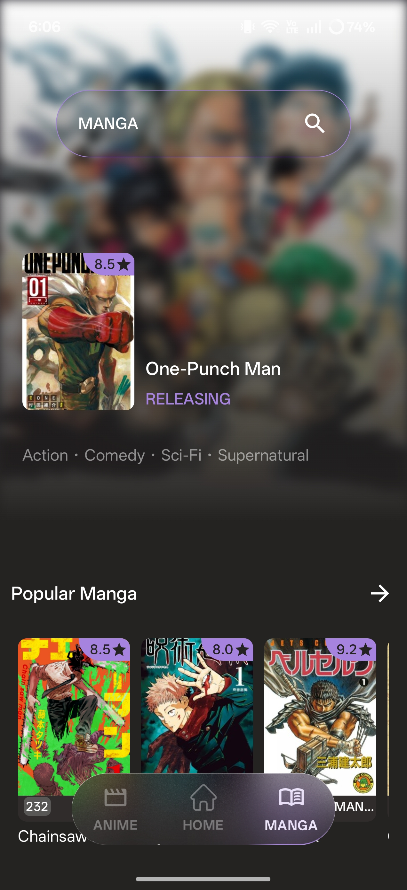
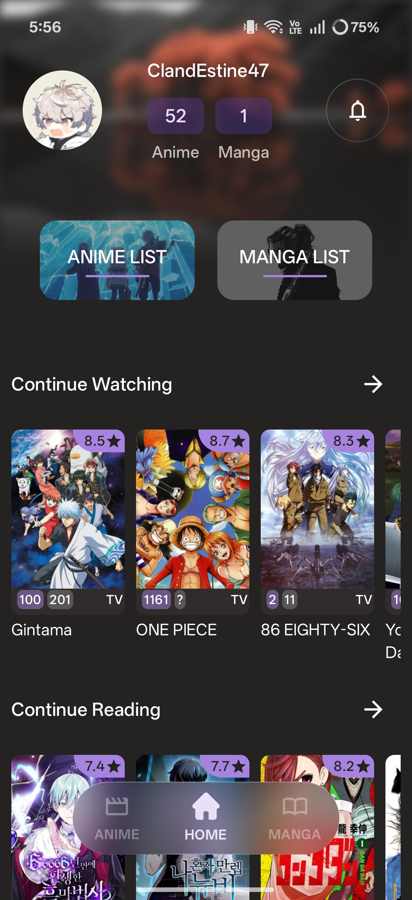
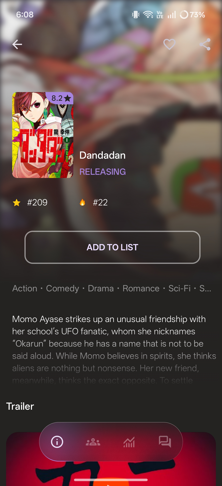
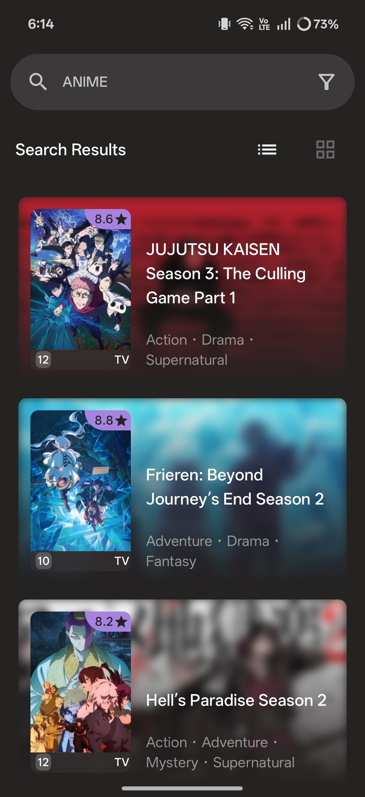
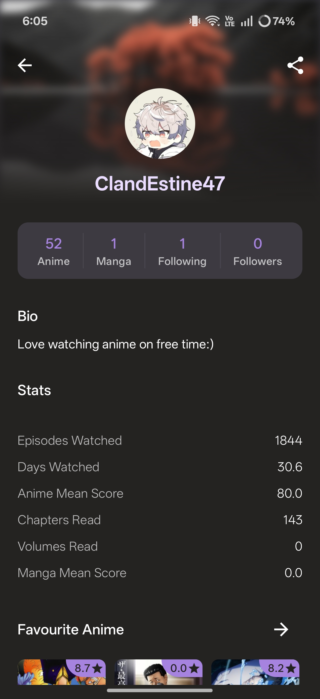
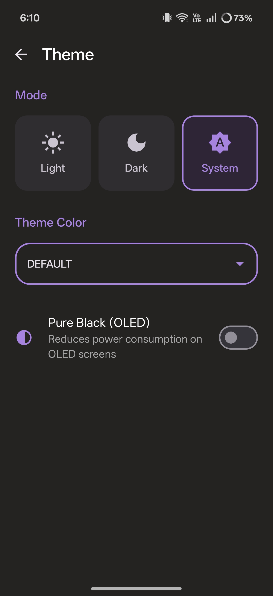

<h1 align="center">Otaku</h1>

  

  <b>Otaku</b> is a modern, high-performance Android application for anime and manga enthusiasts. 
  Discover, track, and explore your favorite anime and manga through a seamless interface powered by <a href="https://anilist.co/">AniList</a>.

---

## ✨ Features

- 🔍 **Advanced Discovery:** Explore seasonal charts, trending titles, and top-rated anime/manga.
- 👤 **AniList Integration:** Full synchronization with your AniList profile and lists.
- 📱 **Modern UI:** A beautiful, responsive interface built 100% with Jetpack Compose and Material 3.
- ⚡ **Type-Safe Navigation:** Built with Kotlin Serialization for safer, scalable routing.
- 🌑 **Dynamic Theming:** Immersive UI experiences with Haze-powered blur and shadow effects.
- 📺 **Trailers:** Watch high-quality trailers directly within the app using `android-youtube-player`.

 

## 📸 Screenshots

   &nbsp; 
   &nbsp; 
  

   &nbsp; 
   &nbsp; 
  

 

## 🏗️ Architecture

Otaku follows modern Android development best practices and uses a **Clean Architecture** approach with a **Multimodular** structure:

- **`:app`**: The application module that wires everything together (DI, Navigation hosting, Activity).
- **`:feature`**: Contains UI components and ViewModels for specific app features.
- **`:core:domain`**: Pure Kotlin module containing business logic, repository interfaces, and domain models.
- **`:core:data`**: Implementation of repositories and data source management (DataStore, Caching).
- **`:core:network`**: Apollo GraphQL integration, API service implementations, and mapping logic.
- **`:core:navigation`**: Centralized, type-safe navigation definitions and `NavActionManager`.

 

## 🚀 Tech Stack

- **UI:** [Jetpack Compose](https://developer.android.com/jetpack/compose) with [Material 3](https://m3.material.io/)
- **Networking:** [Apollo GraphQL](https://www.apollographql.com/docs/kotlin/) for AniList API
- **Dependency Injection:** [Hilt](https://developer.android.com/training/dependency-injection/hilt-android)
- **Image Loading:** [Coil](https://coil-kt.github.io/coil/)
- **Navigation:** [Jetpack Navigation Compose](https://developer.android.com/jetpack/compose/navigation)
- **Persistence:** [DataStore Preferences](https://developer.android.com/topic/libraries/architecture/datastore)
- **Logging & Quality:** [Timber](https://github.com/JakeWharton/timber), [Spotless](https://github.com/diffplug/spotless), [Firebase Crashlytics](https://firebase.google.com/docs/crashlytics)

 

## 🙌 Shoutouts

Inspired by these amazing open-source AniList clients:
- [Dantotsu](https://github.com/rebelonion/Dantotsu)
- [AniHyou](https://github.com/axiel7/AniHyou-android)
- [AL-chan](https://github.com/zend10/AL-chan)

 

---

Built with ❤️ for the Otaku Community

